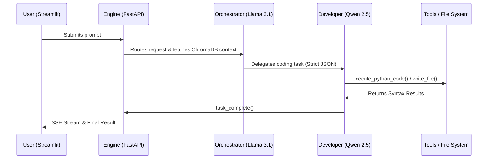

# 🤖 Autonomous Multi-Agent AI Workspace

An advanced, locally hosted multi-agent AI system designed to autonomously write, evaluate, and execute code, manage vector-based memory, and seamlessly route tasks between specialized AI personas. 

This project bridges the gap between traditional conversational AI and fully autonomous, self-correcting agentic workflows. It was built from the ground up to explore complex LLM orchestration, emphasizing enterprise-grade design patterns such as strict tool-usage enforcement, fast-fail circuit breakers, and human-in-the-loop verification.

## 🏗️ System Architecture & Workflow

The system is designed around a decoupled microservices architecture, separating the heavy LLM processing from the user interface.

## ⚙️ How It Works (The Core Logic)

Instead of relying on a single large language model to do everything, this workspace utilizes a specialized team of agents that communicate with each other. 

### 1. Dynamic Routing & RAG
When a user submits a prompt, the FastAPI backend intercepts it. Before generating a response, the system queries a **ChromaDB vector database** (Retrieval-Augmented Generation) to inject relevant historical context. The request is then processed by a routing function that determines the best agent for the job.

### 2. The Autonomous Delegation Loop
The **Orchestrator** agent acts as the tech lead. It breaks down the user's request and delegates specific tasks (e.g., writing a script) to the **Developer** agent. 
* Communication between agents is strictly enforced via JSON payloads.
* The system utilizes a custom aggressive JSON parser to ensure local models do not break the orchestration loop with malformed outputs or unexpected markdown.

### 3. Tool Execution & Circuit Breakers
Agents are equipped with a custom tool registry (`registry.py`) allowing them to read directories, scrape web pages, write files, and test code. 
* **Security:** Python syntax checking is executed safely using `subprocess` with `shell=False` to prevent shell injection vulnerabilities.
* **Circuit Breakers:** If an agent attempts to use an unauthorized tool or enters an infinite micro-management loop, the backend's circuit breaker triggers and safely halts the delegation.

### 4. Human-in-the-Loop (PR Manager)
To prevent rogue code modifications, the system features a built-in Pull Request flow. If an agent wants to modify an existing core file, it must generate a `.draft` file. The system then automatically halts the autonomous loop, generates a visual `diff`, and streams it to the UI, requesting human approval before executing the merge.

### 5. Real-Time SSE Streaming
Running local LLMs can be time-consuming. To provide a seamless user experience, the FastAPI backend utilizes **Server-Sent Events (SSE)**. It yields NDJSON chunks representing the agents' internal monologues, tool executions, and state changes, which the Streamlit frontend displays in a real-time, rolling-window status box.

## 💻 Tech Stack

* **LLM Engine:** Local Ollama (optimized for NVIDIA RTX VRAM compute)
  * `qwen2.5-coder:7b-instruct` (Developer/Execution tasks)
  * `llama3.1:8b` (Orchestration/Routing tasks)
* **Backend:** Python, FastAPI, Uvicorn, Pydantic
* **Frontend:** Streamlit, Python Requests
* **Databases:** ChromaDB (Long-Term Memory), SQLite (Session Management)
* **Web Integration:** DuckDuckGo Search (DDGS), BeautifulSoup (Web Scraping)

## 🚀 Future Roadmap

* **Discord API Integration:** Finalizing a Discord bot controller to allow remote task delegation to the local agent team.
* **Voicebot Expansion:** Exploring integration with ElevenLabs to build an enterprise-grade voice interface for the Orchestrator agent.
* **Automated CI/CD Agent:** Developing an agent responsible solely for formatting and committing successfully merged drafts to version control.